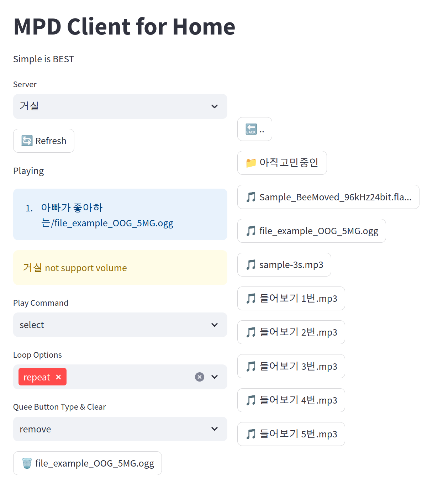

# MPD Client for Home



## Demo
[https://mpdclient.enif.page](https://mpdclient.enif.page)

## Feature
- Simple is BEST concept
- Multi MPD support

## Installation
**Requirements**
- Docker, Docker-Compose or Podman

### Clone
```bash
git clone https://github.com/halfenif/toy_mpdclient_streamlit.git
```

### Set MP3 Folder
Default folder path **'~/music/folder_target'**   
change docker-compose.yml file

## Change Config (Options)
```bash
cp ./fastapi/.env.sample ./fastapi/.env
cp ./streamlit/.env.sample ./streamlit/.env
```
**fastapi/.env**
- ENV_TYPE = ".env.sample" > ".env" Display Information
- IS_DEBUG = bool
- MPD_SERVER_LIST = str(json format). Option. 
- UI_OPTION_SHORT_FILE_NAME = bool. Display button label short or not
- UI_OPTION_SHORT_FILE_LENGTH = int. Display button label char count

**streamlit/.env**
- ENV_TYPE = ".env.sample" > ".env" Display Information
- URL_BACKEND = fastAPI container URL
- UI_OPTION_TITLE = str, st.title(), if "" is None
- UI_OPTION_DESC = str, st.write(), if "" is None
- UI_OPTION_SIDEBAR_WIDTH = int, st.sidebar width


### Docker-Compose
```bash
docker-compose build
docker-compose up
```

### Podman
```bash
./rebuild_podman.sh
```

